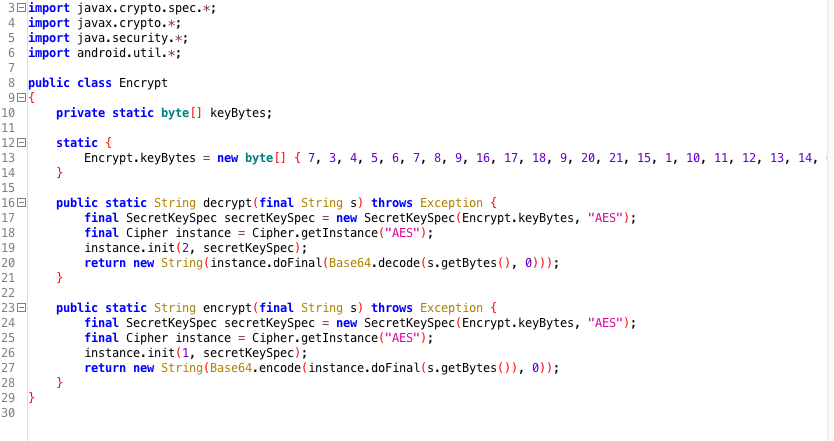

## Android の暗号化 API

[モバイルアプリの暗号化](0x04g-Testing-Cryptography.md) の章では、一般的な暗号のベストプラクティスを紹介し、モバイルアプリで暗号が間違って使用される場合に起こりうる典型的な欠陥について説明しました。この章では、Android の暗号化 API について詳しく説明します。これらの API の使用をソースコード内でどのように識別し、どのように構成を解釈するかを示します。コードをレビューする際には、このガイドからリンクされている最新のベストプラクティスで使用されている暗号パラメータを必ず比較します。

### 暗号標準アルゴリズムの構成の検討

#### 概要

Android 暗号化 API は Java Cryptography Architecture (JCA) に基づいています。JCA はインタフェースと実装を分離し、一連の暗号アルゴリズムを実装できる複数の [セキュリティプロバイダ](https://developer.android.com/reference/java/security/Provider.html "Android Security Providers") を組み込むことができます。ほとんどの JCA インタフェースとクラスは `java.security.*` および `javax.crypto.*` パッケージで定義されています。さらに、Android 固有のパッケージ `android.security.*` および `android.security.keystore.*` もあります。

Android に含まれるプロバイダのリストは Android のバージョンと OEM 固有のビルドにより異なります。一部の古いバージョンのプロバイダ実装は安全性が低く脆弱であることが知られています。したがって、Android アプリケーションは正しいアルゴリズムを選択して適切な設定を行うだけでなく、場合によっては過去のプロバイダの実装の強度にも注意を払う必要があります。

既存のプロバイダのセットは以下のように一覧表示できます。

```java
StringBuilder builder = new StringBuilder();
for (Provider provider : Security.getProviders()) {
    builder.append("provider: ")
            .append(provider.getName())
            .append(" ")
            .append(provider.getVersion())
            .append("(")
            .append(provider.getInfo())
            .append(")\n");
}
String providers = builder.toString();
//now display the string on the screen or in the logs for debugging.
```

以下は、セキュリティプロバイダにパッチを当てた後、Google Play API を搭載したエミュレータで実行中の Android 4.4 の出力です。

```
provider: GmsCore_OpenSSL1.0 (Android's OpenSSL-backed security provider)
provider: AndroidOpenSSL1.0 (Android's OpenSSL-backed security provider)
provider: DRLCertFactory1.0 (ASN.1, DER, PkiPath, PKCS7)
provider: BC1.49 (BouncyCastle Security Provider v1.49)
provider: Crypto1.0 (HARMONY (SHA1 digest; SecureRandom; SHA1withDSA signature))
provider: HarmonyJSSE1.0 (Harmony JSSE Provider)
provider: AndroidKeyStore1.0 (Android KeyStore security provider)
```

古いバージョンの Android をサポートする一部のアプリケーションでは、最新のライブラリをバンドルすることが唯一の選択肢かもしれません。Spongy Castle (Bouncy Castle の再パッケージ版) はこのような状況では一般的な選択肢です。Bouncy Castle は Android SDK に含まれているため、再パッケージ化が必要です。[Spongy Castle](https://rtyley.github.io/spongycastle/ "Spongy Castle") の最新バージョンではAndroid に含まれていた旧バージョンの [Bouncy Castle](https://www.cvedetails.com/vulnerability-list/vendor_id-7637/Bouncycastle.html "CVE Details Bouncy Castle") で発生した問題が修正されている可能性があります。Android にパックされた Bouncy Castle ライブラリは多くの Bouncy Castle の対応ほど完全ではないことがよくあることに注意します。最後に、Spongy Castle のような大きなライブラリをパックすることは、しばしばマルチ dex 化 Android アプリケーションにつながることを心に留めておきます。

Android SDK はセキュアな鍵生成および使用を記述するためのメカニズムを提供します。Android 6.0 (Marshmallow, API 23) ではアプリケーションで正しい鍵の使用を保証するために使用できる `KeyGenParameterSpec` クラスを導入しました。

API 23 以降での AES/CBC/PKCS7Padding の使用例を以下に示します。

```Java
String keyAlias = "MySecretKey";

KeyGenParameterSpec keyGenParameterSpec = new KeyGenParameterSpec.Builder(keyAlias,
        KeyProperties.PURPOSE_ENCRYPT | KeyProperties.PURPOSE_DECRYPT)
        .setBlockModes(KeyProperties.BLOCK_MODE_CBC)
        .setEncryptionPaddings(KeyProperties.ENCRYPTION_PADDING_PKCS7)
        .setRandomizedEncryptionRequired(true)
        .build();

KeyGenerator keyGenerator = KeyGenerator.getInstance(KeyProperties.KEY_ALGORITHM_AES,
        "AndroidKeyStore");
keyGenerator.init(keyGenParameterSpec);

SecretKey secretKey = keyGenerator.generateKey();
```

`KeyGenParameterSpec` は鍵を暗号化および復号化に使用できることを示しますが、署名や検証などの他の目的は示しません。さらに、ブロックモード (CBC)、パディング (PKCS7) を指定し、ランダム化された暗号化が必要であることを明示します (これがデフォルトです) 。`"AndroidKeyStore"` はこの例で使用される暗号化サービスプロバイダの名前です。

GCM はもうひとつの AES ブロックモードであり、他の古いモードよりもセキュリティ上の利点があります。暗号的によりセキュアであることに加えて、認証も提供します。CBC (および他のモード) を使用する場合は、認証は HMAC を使用して別に実行する必要があります (リバースエンジニアリングの章を参照してください) 。GCM は [パディングをサポートしない](https://developer.android.com/training/articles/keystore.html#SupportedCiphers "Supported Ciphers in KeyStore") AES の唯一のモードであることに注意します。

上記の仕様に違反して生成された鍵の使用を試みるとセキュリティ例外が発生します。

その鍵を使用して復号する例を以下に示します。

```Java
String AES_MODE = KeyProperties.KEY_ALGORITHM_AES
        + "/" + KeyProperties.BLOCK_MODE_CBC
        + "/" + KeyProperties.ENCRYPTION_PADDING_PKCS7;
KeyStore keyStore = KeyStore.getInstance("AndroidKeyStore");

// byte[] input
Key key = keyStore.getKey(keyAlias, null);

Cipher cipher = Cipher.getInstance(AES_MODE);
cipher.init(Cipher.ENCRYPT_MODE, key);

byte[] encryptedBytes = cipher.doFinal(input);
byte[] iv = cipher.getIV();
// save both the iv and the encryptedBytes
```

IV (初期化ベクトル) および暗号化されたバイト列の両方を格納する必要があります。さもなければ解読は不可能です。

暗号文を復号する方法を以下に示します。`input` は暗号化されたバイト配列であり、`iv` は暗号ステップからの初期化ベクトルです。

```Java
// byte[] input
// byte[] iv
Key key = keyStore.getKey(AES_KEY_ALIAS, null);

Cipher cipher = Cipher.getInstance(AES_MODE);
IvParameterSpec params = new IvParameterSpec(iv);
cipher.init(Cipher.DECRYPT_MODE, key, params);

byte[] result = cipher.doFinal(input);
```

IV は毎回ランダムに生成されるため、後で復号するために暗号文 (`encryptedBytes`) とともに保存する必要があります。

Android 6.0 以前は、AES 鍵の生成はサポートされていませんでした。結果として、多くの実装では RSA を使用することを選択し、`KeyPairGeneratorSpec` を使用して非対称暗号化の公開鍵と秘密鍵のペアを生成しました。あるいは `SecureRandom` を使用して AES 鍵を生成しました。

RSA 鍵ペアの作成に使用される `KeyPairGenerator` および `KeyPairGeneratorSpec` の例を以下の示します。

```Java
Date startDate = Calendar.getInstance().getTime();
Calendar endCalendar = Calendar.getInstance();
endCalendar.add(Calendar.YEAR, 1);
Date endDate = endCalendar.getTime();
KeyPairGeneratorSpec keyPairGeneratorSpec = new KeyPairGeneratorSpec.Builder(context)
        .setAlias(RSA_KEY_ALIAS)
        .setKeySize(4096)
        .setSubject(new X500Principal("CN=" + RSA_KEY_ALIAS))
        .setSerialNumber(BigInteger.ONE)
        .setStartDate(startDate)
        .setEndDate(endDate)
        .build();

KeyPairGenerator keyPairGenerator = KeyPairGenerator.getInstance("RSA",
        "AndroidKeyStore");
keyPairGenerator.initialize(keyPairGeneratorSpec);

KeyPair keyPair = keyPairGenerator.generateKeyPair();
```

この例では 4096 ビットの鍵サイズ (すなわち、モジュラスサイズ) で RSA 鍵のペアを作成します。

#### 静的解析

コード内の暗号化プリミティブの使用を見つけます。最もよく使用されるクラスとインタフェースのいくつかを以下に示します。

- `Cipher`
- `Mac`
- `MessageDigest`
- `Signature`
- `Key`, `PrivateKey`, `PublicKey`, `SecretKey`
- `java.security.*` および `javax.crypto.*` パッケージにあるその他のもの

「モバイルアプリの暗号化」の章に記載されているベストプラクティスに従っていることを確認します。使用されている暗号アルゴリズムの構成が [NIST](https://www.keylength.com/en/4/ "NIST recommendations - 2016") および[BSI](https://www.keylength.com/en/8/ "BSI recommendations - 2017") のベストプラクティスと整合し、強力であるとみなされていることを確認します。

### 乱数生成のテスト

#### 概要

暗号にはセキュアな擬似乱数生成 (PRNG) が必要です。標準の Java クラスは十分なランダム性を提供しないため、実際に攻撃者が生成される次の値を推測し、この推測を使用して別のユーザーになりすましたり機密情報にアクセスしたりする可能性があります。

一般的に、`SecureRandom` を使用すべきです。しかし、KitKat 以前の Android バージョンをサポートする場合には、[PRNG を適切に初期化できない](https://android-developers.googleblog.com/2013/08/some-securerandom-thoughts.html "Some SecureRandom Thoughts") Jelly Bean (Android 4.1-4.3) バージョンのバグを回避するために更なる注意が必要です。

ほとんどの開発者は引数なしでデフォルトコンストラクタを介して `SecureRandom` をインスタンス化する必要があります。他のコンストラクタはより高度な用途のためにあり、誤って使用されると、ランダム性やセキュリティが低下する可能性があります。`SecureRandom` を支援する PRNG プロバイダは `/dev/urandom` デバイスファイルをデフォルトのランダム性のソースとして使用します [#nelenkov] 。

#### 静的解析

乱数生成器のインスタンスをすべて特定して、カスタムまたは既知のセキュアでない `java.util.Random` クラスを探します。このクラスは与えられた各シード値に対して同じ一連の番号を生成します。その結果、一連の数は予測可能となります。

以下のサンプルソースコードは脆弱な乱数生成を示しています。

```Java
import java.util.Random;
// ...

Random number = new Random(123L);
//...
for (int i = 0; i < 20; i++) {
  // Generate another random integer in the range [0, 20]
  int n = number.nextInt(21);
  System.out.println(n);
}
```

代わりに、その分野の専門家により現時点で強力であると考えられている十分に検証されたアルゴリズムを使用し、適切な長さのシードを持つ十分にテストされた実装を選択すべきです。

デフォルトコンストラクタを使用して作成されていない `SecureRandom` のすべてのインスタンスを特定します。シード値を指定するとランダム性が低下する可能性があります。システム指定のシード値を使用して 128 バイト長の乱数を生成する [`SecureRandom` の引数なしコンストラクタ](https://www.securecoding.cert.org/confluence/display/java/MSC02-J.+Generate+strong+random+numbers "Generation of Strong Random Numbers") を選択します。

一般的に、PRNG が暗号的にセキュアであると宣言されていない場合 (`java.util.Random` など) 、それはおそらく統計的 PRNG であり、セキュリティ上機密であるコンテキストに使用すべきではありません。
擬似乱数生成器が既知であり、シードが推定できる場合、その生成器は [予測可能な数値を生成します](https://www.securecoding.cert.org/confluence/display/java/MSC63-J.+Ensure+that+SecureRandom+is+properly+seeded "Proper seeding of SecureRandom") 。128 ビットシードは「十分にランダムな」数値を生成するためのよい出発点です。

以下のサンプルソースコードはセキュアな乱数の生成を示しています。

```Java
import java.security.SecureRandom;
import java.security.NoSuchAlgorithmException;
// ...

public static void main (String args[]) {
  SecureRandom number = new SecureRandom();
  // Generate 20 integers 0..20
  for (int i = 0; i < 20; i++) {
    System.out.println(number.nextInt(21));
  }
}
```

#### 動的解析

攻撃者はどのタイプの脆弱な疑似乱数生成器 (PRNG) が使用されているかを知ることで、[Java Random で行われたように](https://franklinta.com/2014/08/31/predicting-the-next-math-random-in-java/ "Predicting the next Math.random() in Java") 、以前に観測された値に基づいて次の乱数値を生成する概念実証を書くことは簡単です。非常に脆弱なカスタム乱数生成器の場合にはパターンを統計的に観測することが可能かもしれません。推奨される方法はとにかく APK を逆コンパイルしてアルゴリズムを検査することです (静的解析を参照してください) 。


### 鍵管理のテスト

#### 概要

対称暗号は基本的な暗号原則を保証するためデータの機密性と完全性を提供します。これは元の暗号鍵が提供されるときには、与えられた暗号文がいかなる状況においても復号できるという事実に基づいています。セキュリティの問題はこれにより今ではセキュアに暗号化されているコンテンツの代わりに鍵をセキュアにすることに移行しています。非対称暗号は秘密鍵 (private key) と公開鍵のペアの概念を導入することでこの問題を解決します。公開鍵は自由に配布できますが、秘密鍵 (private key) は秘密に保たれます。

Android アプリケーションを暗号の正しい使い方でテストする際には、鍵マテリアルがセキュアに生成され保存されることを確認することも重要です。このセクションでは暗号鍵を管理するさまざまな方法とそれらをテストする方法について説明します。私たちは鍵マテリアルの生成および保存の最もセキュアな方法からセキュアではない方法に至るまで説明します。

鍵マテリアルを扱う最もセキュアな方法は単にファイルシステムにそれを保存しないことです。これはアプリケーションが暗号操作を実行する必要があるたびに、パスフレーズを入力するようにユーザーに指示する必要があることを意味しています。これはユーザーエクスペリエンスの観点からは理想的な実装ではありませんが、鍵マテリアルを扱う最もセキュアな方法です。その理由は鍵マテリアルが使用されている間、メモリ内の配列でのみ利用可能になるためです。その鍵がもはや必要なくなれば、配列をゼロにすることができます。これにより攻撃ウィンドウを可能な限り最小限にします。鍵マテリアルはファイルシステムに触れず、パスフレーズは保存されません。しかし、一部の暗号はそれらのバイト配列を適切にクリーンアップしないことに注意します。例えば、BouncyCastle の AES 暗号は最新の作業鍵を常にクリーンアップするとは限りません。

暗号鍵は Password Based Key Derivation Function version 2 (PBKDFv2) を使用してパスフレーズから生成できます。この暗号プロトコルはセキュアであり、かつブルートフォースできない鍵を生成するように設計されています。以下のコードはパスワードに基づいて強力な暗号鍵を生成する方法を示しています。

```Java
public static SecretKey generateStrongAESKey(char[] password, int keyLength)
{
    //Initiliaze objects and variables for later use
    int iterationCount = 10000;
    int saltLength     = keyLength / 8;
    SecureRandom random = new SecureRandom();

    //Generate the salt
    byte[] salt = new byte[saltLength];
    randomb.nextBytes(salt);

    KeySpec keySpec = new PBEKeySpec(password.toCharArray(), salt, iterationCount, keyLength);
    SecretKeyFactory keyFactory = SecretKeyFactory.getInstance("PBKDF2WithHmacSHA1");
    byte[] keyBytes = keyFactory.generateSecret(keySpec).getEncoded();
    return new SecretKeySpec(keyBytes, "AES");
}
```
上記の手法はパスワードと必要な鍵長をビットに含む文字配列、例えば 128 または 256 ビットの AES 鍵が必要です。PBKDFv2 アルゴリズムにより使用される 10000 ラウンドの反復回数を定義します。これによりブルートフォース攻撃の作業負荷が大幅に増加します。鍵長に等しいソルトサイズを定義し、ビットからバイトへの変換に気をつけて 8 で割ります。```SecureRandom``` クラスを使用して、ランダムにソルトを生成します。同じパスワードが与えられた後に同じ暗号鍵が生成されることを確実にするために、明らかに、このソルトは固定に保ちたいものです。ソルトを保存するには追加のセキュリティ対策は必要ありません。これは暗号化の必要なしで ```SharedPreferences``` 内に公に保存できます。その後、推奨される ```PBKDF2WithHmacSHA1``` アルゴリズムを使用して、Password-based Encryption (PBE) が生成されます。

今では、定期的にユーザーにパスフレーズを促すことはすべてのアプリケーションにとって機能するものではないことは明らかです。その場合には必ず [Android KeyStore API](https://developer.android.com/reference/java/security/KeyStore.html "Android KeyStore API") を使用してください。この API は鍵マテリアルにセキュアなストレージを提供するために特別に開発されました。あなたのアプリケーションだけが生成した鍵にアクセスできます。Android 6.0 からはキーストアのハードウェア支援も強制されます。これは鍵マテリアルをセキュアにするために専用の暗号チップまたは Trusted Platform Module (TPM) が使用されていることを意味します。

但し、```KeyStore``` API は Android のさまざまなバージョンで大幅に変更されていることに注意します。以前のバージョンでは ```KeyStore``` は公開鍵と秘密鍵 (private key) のペア (RSA など) の保存のみをサポートしていました。対称鍵のサポートは API レベル 23 以降でのみ追加されています。結果として、さまざまな Android API レベルで対称鍵をセキュアに保存したいときには開発者は注意する必要があります。対称鍵をセキュアに保存するには、Android API レベル 22 以下で動作するデバイスで、公開鍵と秘密鍵 (private key) のペアを生成する必要があります。公開鍵を使用して対象鍵を暗号化し、秘密鍵 (private key) を ```KeyStore``` に保存します。暗号化された対称鍵は ```SharedPreferences``` に安全に保存できます。対称鍵が必要なときにはいつでも、アプリケーションは ```KeyStore``` から秘密鍵 (private key) を取り出し、対称鍵を復号します。

暗号鍵を保存するあまりセキュアではない方法は Android の SharedPreferences におくことです。[SharedPreferences](https://developer.android.com/reference/android/content/SharedPreferences.html "Android SharedPreference API") が [MODE_PRIVATE](https://developer.android.com/reference/android/content/Context.html#MODE_PRIVATE "MODE_PRIVATE") で初期化された場合、そのファイルはそれを作成したアプリケーションによってのみ読み取り可能です。但し、ルート化されたデバイスでは、ルートアクセス権を持つ他のアプリケーションが他のアプリの SharedPreference ファイルを簡単に読み取ることができます。MODE_PRIVATE が使われれているかどうかは関係ありません。キーストアについてはそうではありません。キーストアのアクセスはカーネルレベルで管理されているため、キーストアが鍵をクリアまたは破棄することなくバイパスするにはかなりの作業とスキルが必要です。

最後の二つの選択肢はソースコード上にハードコードされた暗号鍵を使用することと、```/sdcard/``` などの公開された場所に生成された鍵を保存することです。明らかに、ハードコードされた暗号鍵はよい方法ではありません。これはアプリケーションのすべてのインスタンスが同じ暗号鍵を使用することを意味します。攻撃者は、ソースコードから鍵を抽出するために、一度作業を行うだけで済みます。結果的に、攻撃者は彼が取得してアプリケーションにより暗号化されている他のデータを復号できます。最後に、暗号鍵を公開されている場所に保存することもできる限り避けます。他のアプリケーションは公開パーティションを読み取るためのパーミッションを持ち、鍵を盗むことができます。

#### 静的解析

リバースエンジニアまたは逆アセンブルされたコードで暗号プリミティブの使用を特定します。最も頻繁に使用されるクラスとインタフェースの一部を以下に示します。

- `Cipher`
- `Mac`
- `MessageDigest`
- `Signature`
- `KeyStore`
- `Key`, `PrivateKey`, `PublicKey`, `SecretKeySpec`
- `java.security.*` および `javax.crypto.*` パッケージにあるその他のもの

例として、ハードコードされた暗号鍵の使用の特定方法を示します。最初に ```Baksmali``` を使用して Smali バイトコードのコレクションに DEX バイトコードを逆アセンブルします。
```shell
$ baksmali d file.apk -o smali_output/
```
Smali バイトコードファイルのコレクションがあるので、```SecretKeySpec``` クラスの使用法についてファイルを検索できます。今取得した Smali ソースコードを単に再帰的に grep することでこれを行います。Smali のクラス記述子は `L` で始まり `;` で終わることに注意してください。
```shell
$ grep -r "Ljavax\crypto\spec\SecretKeySpec;"
```
これは ```SecretKeySpec``` クラスを使用するすべてのクラスをハイライト表示します。ハイライトされたすべてのファイルを調べて、鍵マテリアルを渡すのに使用されているバイトはどれかをトレースします。下の図は出荷準備が完了したアプリケーションでこの評価を行った結果を示しています。読みやすくするため、DEX バイトコードから Java コードにリバースエンジニアしました。静的バイト配列 ```Encrypt.keyBytes``` にハードコードされ初期化された静的暗号鍵の使用がはっきりとわかります。


#### 動的解析

暗号メソッドをフックし、使用されている鍵を解析します。暗号操作が行われている間にファイルシステムへのアクセスを監視して、鍵マテリアルがどこに書き込まれるか、どこから読み取られるかを評価します。

### 参考情報

- [#nelenkov] - N. Elenkov, Android Security Internals, No Starch Press, 2014, Chapter 5.

##### OWASP Mobile Top 10

- M5 - 不十分な暗号化

##### OWASP MASVS

- V3.1: "アプリは暗号化の唯一の方法としてハードコードされた鍵による対称暗号化に依存していない。"
- V3.3: "アプリは特定のユースケースに適した暗号化プリミティブを使用している。業界のベストプラクティスに基づくパラメータで構成されている。"
- V3.5: "アプリは複数の目的のために同じ暗号化鍵を再利用していない。"
- V3.6: "すべての乱数値は、十分に安全な乱数生成器を用いて生成している。"

##### CWE

- CWE-321 - Use of Hard-coded Cryptographic Key
- CWE-326 - Inadequate Encryption Strength
- CWE-330 - Use of Insufficiently Random Values
